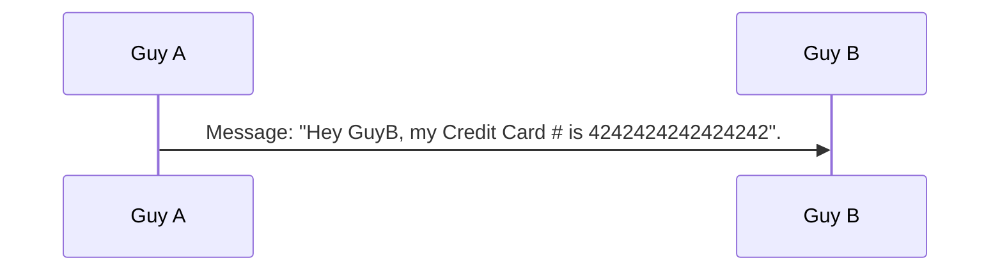
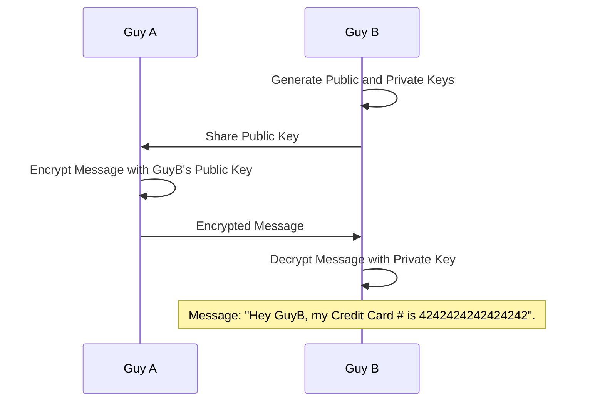
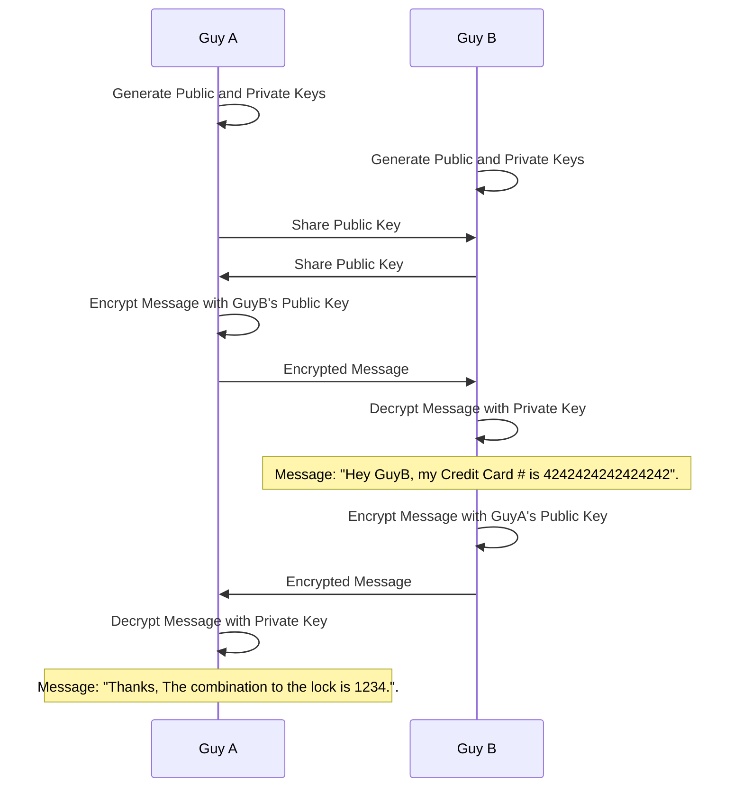
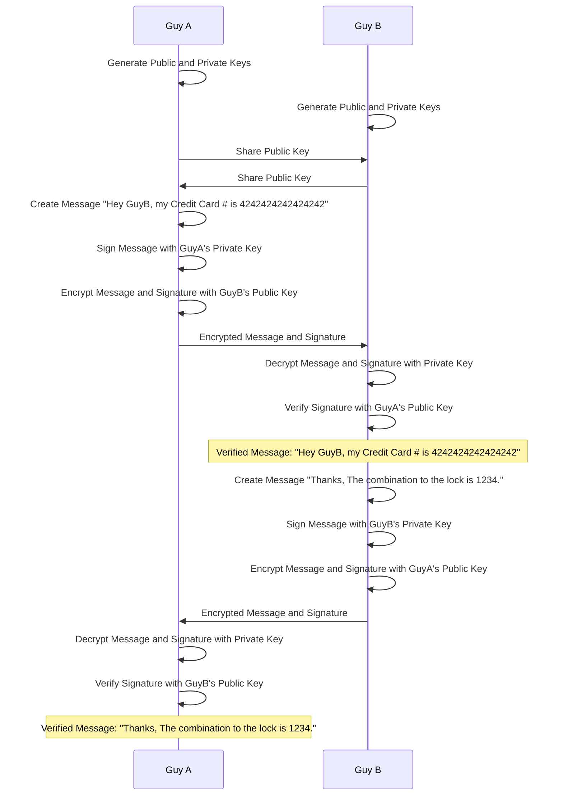

title = "From Theory to Practice: Unlocking the Secrets of Secure Communication with Certificates and Keys"
date = 2024-01-07T11:10:00+02:00
tags = [
    "key",
    "cert",
    "symmetric",
	"asymmetric",
	"encryption",
	"public",
	"private",
	"rsa",
	"sha256",
    "introduction",
    "intro",
    "security"
]
published = true
+++++

In this post, we'll explore the practical use of Certificates and Keys in secure communication, an essential skill for anyone on the tech journey, regardless of how they've learned. Be it through a coding bootcamp, self-study, or a formal Computer Science degree, mastering Certificates and Keys is an inevitable and crucial milestone. This post was inspired by my own recent realization of a gap between theoretical knowledge and practical application in this area. Driven to bridge this gap for myself and others, I've put together this guide to demystify the real-world use of Certificates and Keys, helping those who might be facing similar challenges.

First lets take into account that people refer to `key-based encryption` using a variety of names as you might have heard that encompass this security technology :
 - Symmetric Encryption
 - Asymmetric Encryption
 - Public Key Encryption
 - Private Key Encryption
 - RSA Encryption

These names normally refer to the type of key, or way data is encrypted, however for this post, I'll use the term `key-based encryption` to kind of summarize what we are doing.

Lets theorize there are two people who need to send sensitive messages to one another. Guy A and Guy B.

Normally, if Guy A sends the message to Guy B then a dubious attacker could intercept the message in transit and read it.



As you can see the credit card number `4242424242424242` is obviously visible. In fact, if a man in the middle has the appropriate skills, they might be able to modify the credit card number while in transit so that GuyB sends the money to the wrong person.

So how does one keep the credit card number private? Keys!



Excellent, now GuyA can send GuyB messages without fuss, however there is another problem. GuyB cannot send any encrypted messages back to GuyA. To solve this lets have both GuyA and GuyB generate keys and exchange their public keys with one another.



Simple, now both GuyA and GuyB can send and receive secure communication from one another. Or can they? You see a problem still exists where a hacker that sits in the middle of GuyA and GuyB can actually read and replace their keys & messages. The following sequence diagram illustrates this vulnerability.


An issue exists where GuyA and GuyB unknowingly encrypt data using a hackers fake keys. This allows the hacker to view and alter the contents of a message without their knowledge or consent.

So we need a way to verify that the messages are from who they say they are, this is where we introduce the concept of a digital signature. 

  
A digital signature consists of the original message's hashed form. Here are the steps for encrypting a message prior to its transmission.

1) Hash the message. (SHA256)
2) Encrypt the Hash with your own Private Key.
3) Combine the Message and the Signature
```
Message: "Hello GuyB, this is a confidential message." 
Signature: XYZ7890
```
4) Encrypt with your destination's public key(GuyB in this case).
5) Send it over the wire!

And below is a full sequenceDiagram of the interaction of a message and response between GuyA and GuyB.



Now we have a communication protocol that protects GuyA and GuyB from being exploited by an hacker. :) 

So how do we do this in real life? Lets take a look.

## Instructions using OpenSSL

First off, we need GuyA and GuyB to generate their own public and private keys. To do this lets assume they both have a recent version of the tool `openssl` installed.

1. **Guy A Generates Public and Private Keys**

    ```bash
    openssl genpkey -algorithm RSA -out guyA_private.pem
    openssl rsa -pubout -in guyA_private.pem -out guyA_public.pem
    ```

2. **Guy B Generates Public and Private Keys**
```bash
openssl genpkey -algorithm RSA -out guyB_private.pem
openssl rsa -pubout -in guyB_private.pem -out guyB_public.pem
```

3. **Guy A and Guy B to Exchange Public Keys**
   - Guy A sends `guyA_public.pem` to Guy B.
   - Guy B sends `guyB_public.pem` to Guy A.

#### Guy A Creates and Sends a Message to Guy B
1. **Guy A Creates a Message**
   - Message: "Hey GuyB, my Credit Card # is 4242424242424242".
   - Save this text in a file called `messageA.txt`.

2. **Guy A Signs the Message with His Private Key**
```bash
openssl dgst -sha256 -sign guyA_private.pem -out signatureA.bin messageA.txt
```

3. **Guy A Encrypts the Message and Signature with Guy B's Public Key**
```bash
cat messageA.txt signatureA.bin > messageA_with_signature.bin
openssl rsautl -encrypt -inkey guyB_public.pem -pubin -in messageA_with_signature.bin -out encrypted_messageA.bin
```

4. **Guy A Sends the Encrypted Message and Signature to Guy B**

#### Guy B Receives and Processes Guy A's Message
1. **Guy B Decrypts the Message and Signature with His Private Key**
```bash
openssl rsautl -decrypt -inkey guyB_private.pem -in encrypted_messageA.bin -out decrypted_messageA_with_signature.bin
```

2. **Guy B Verifies the Signature with Guy A's Public Key**
   - Separate the original message and the signature.
```bash
# Assuming the message and signature are concatenated in the decrypted file.
# You may need to separate them manually or using a script.
```
   - Verify the signature.
```bash
openssl dgst -sha256 -verify guyA_public.pem -signature signatureA.bin messageA.txt
```

   - If the verification is successful, Guy B can trust that the message is indeed from Guy A and has not been tampered with.

#### Guy B Sends a Response to Guy A
1. **Guy B Creates a Response Message**
   - Message: "Thanks, The combination to the lock is 1234."
   - Save this message in a file, say `messageB.txt`.

2. **Guy B Signs the Message with His Private Key**
```bash
openssl dgst -sha256 -sign guyB_private.pem -out signatureB.bin messageB.txt
```

3. **Guy B Encrypts the Message and Signature with Guy A's Public Key**
```bash
cat messageB.txt signatureB.bin > messageB_with_signature.bin
openssl rsautl -encrypt -inkey guyA_public.pem -pubin -in messageB_with_signature.bin -out encrypted_messageB.bin
```

4. **Guy B Sends the Encrypted Message and Signature to Guy A**

#### Guy A Receives and Processes Guy B's Message
1. **Guy A Decrypts the Message and Signature with His Private Key**
```bash
openssl rsautl -decrypt -inkey guyA_private.pem -in encrypted_messageB.bin -out decrypted_messageB_with_signature.bin
```

2. **Guy A Verifies the Signature with Guy B's Public Key**
   - Separate the original message and the signature.
   - Verify the signature.
```bash
openssl dgst -sha256 -verify guyB_public.pem -signature signatureB.bin messageB.txt
```

If the verification is successful, Guy A can now trust that the response is indeed from Guy B and has not been tampered with!

Remember, while key-based encryption may seem daunting at first, regular practice and application can make it an invaluable tool in your security arsenal

Enjoy!

