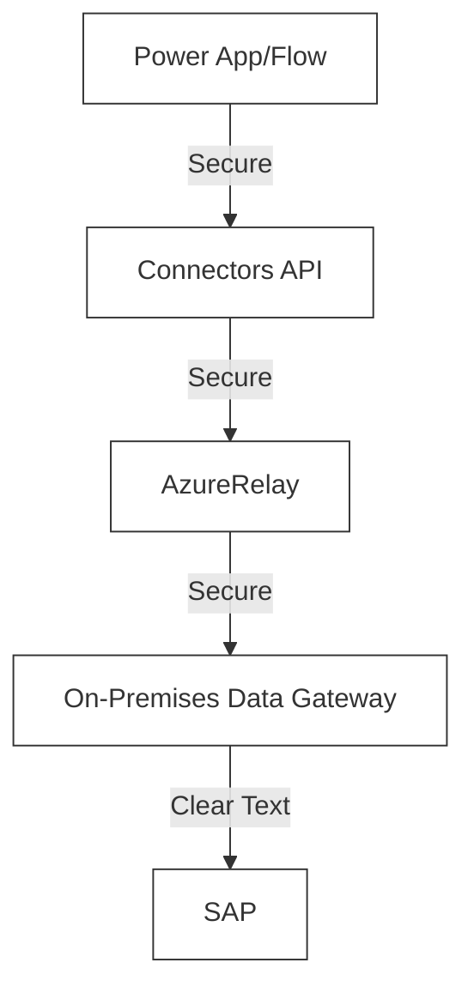
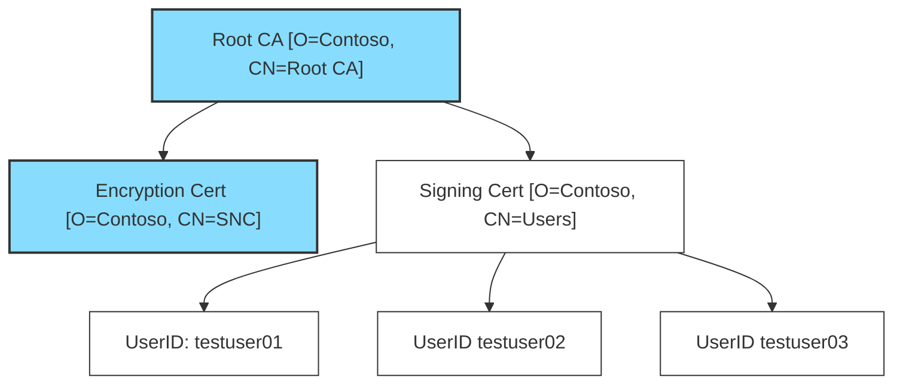

title = "Setting Up SNC between Power Apps/Automate and SAP"
date = 2024-02-26T18:13:00+02:00
tags = [
  "sap",
  "snc",
  "power",
	"apps",
	"automate",
	"platform",
	"encryption",
	"secure",
  "x509",
  "X.509"
]
published = true
+++++

My team and I spend our 9 to 5 working on the [SAP ERP Connector](https://learn.microsoft.com/en-us/connectors/saperp/) for Power Apps/Automate. A key focus of our work is ensuring secure, encrypted transit when connecting to SAP, particularly for production systems. This vital security measure is designed to protect your data from interception or exposure during transit and to guard against man-in-the-middle attacks.

While securing connections to SAP, we shift from the typical TLS (Transport Layer Security) to **public key encryption**, known as [Secure Network Communications (SNC)](https://help.sap.com/doc/saphelp_nw74/7.4.16/en-us/e6/56f466e99a11d1a5b00000e835363f/content.htm?no_cache=true). This approach mirrors the standard practice of verifying website security – like checking for the lock icon in a browser's URL bar – but with a focus tailored for SAP's unique requirements.

For more insights, updates, and discussions on this and related topics, feel free to connect with me on X (formerly Twitter) at [@Ryanb58](https://x.com/Ryanb58). Now, let's examine a data flow diagram from Power App/Flow to SAP:



Notice how, in the diagram, the connection between the On-Premises Data Gateway (OPDG) and SAP is unencrypted. Although this might not pose a significant risk if both systems are securely isolated within your local network, adopting SNC offers a straightforward solution to enhance your data's security. SNC ensures that your sensitive information remains out of reach from unauthorized access and simplifies the technical process.

As we delve into the technical steps, feel free to adapt parts of this tutorial as needed. Remember, not all steps may apply to every scenario, so some improvisation might be necessary.

# Setting Up SNC between SAP and OPDG

## Pre-Requisite

- S-User Account on SAP's website(Helpful when resolving error messages and downloading required resources)
- Windows Machine with the latest [OPDG Installed](https://aka.ms/opdg)
- SAP Instance
	- Ability to Restart
	- Administrator Account
- SAP GUI with login
- OpenSSL
	- If you have `Git for Windows` installed, then you can access the `openssl` command by opening up `Git Bash`.
	- If you are without, do not fear, you can use [winget](https://github.com/microsoft/winget-cli) to install a distribution of it built by FireDaemon. `winget install --id FireDaemon.OpenSSL`

## SAP Common Crypto

SAP Common Crypto is a distribution from SAP that allows the OPDG to talk to SAP in an encrypted way. It will come as a `.SAR` file type, so we will need it and a way to extract the data from it.

### Download SAPCAR

1. Go to the [SAP Software Center](https://me.sap.com/softwarecenter).
2. Type `SAPCAR` into the `Search for Software Downloads` search box.
3. Click on the top result(non archived).
4. From there, select the latest version. At the time of this writing I selected `SAPCAR 7.53`.
5. Select the operating system type in the dropdown located above the search results.
  

6. Click on the result to download the .EXE file. I placed mine in `C:\sap\SAR`

### Download SAP Common Crypto

1. Go back to the [SAP Software Center](https://me.sap.com/softwarecenter).
2. Type `COMMONCRYPTOLIB` into the `Search for Software Downloads` search box.
3. Select the `COMMONCRYPTOLIB 8` result.
4. Select the operating system type in the dropdown located above the search results.
   
5. Click on the title of the listing with the most recent `Release Date` to download the .SAR file.

### Extract SAP Common Crypto

1. Open a PowerShell window to `C:\sap\SAR`.
2. Extract SAP Common Crypto using the command below.
  ```powershell
  .\SAPCAR_1200-70007719.EXE -xvf .\SAPCRYPTOLIBP_8553-20011729.SAR -R .\..\libs\sapcryptolib
  ```
1. This will extract the files to `C:\sap\libs\sapcryptolib`.
2. You should see `sapgenpse.exe` in the folder. This is an important program we will use later on.

## Setting up SECUDIR environment variable on the OPDG

We will start by creating this named folder. The name in itself does not matter, but for this tutorial we will use `sapsecudir` and we will put it in the root directory.

```powershell
C:\> mkdir sapsecudir
C:\> cd .\sapsecudir
```

Define an environment variable called `SECUDIR` and point it at that directory.

First we backup our existing `PATH` environment variable into a file.

```powershell
C:\sapsecudir> $env:path >> ("env-PATH_" + (Get-Date -Format "yyyy-MM-dd_HH-mm-ss") + ".out")
```

And permanently add `SECUDIR` to our machine. This variable will persist between restarts.

```powershell
[Environment]::SetEnvironmentVariable("SECUDIR", "C:\sapsecudir", "Machine") # Sets the variable permentaly on the system.
$env:SECUDIR = "C:\sapsecudir" # Updates the current powershell session as there currently does not exist a function to reload.
```

Then restart your On-Premises Data Gateway for the changes to take effect.

## Generating Certificates

Some of you might already have a PKI setup. In this tutorial, I do not have one, so I will create one on the fly that can be expanded to X.509 user authentication later on.

Below is a visual to help with understanding of what certificate will do what and how it can be expanded to issue user certs in the future. In this tutorial we will focus on implementing the blue boxes.

This section is not recommended for production systems, however is a good way to get a demo up and running quickly.



Now we are ready to create the folder structure for our certificates. Navigate to a secure place on your disk that'll you'll keep around, as we will be generating sensitive data here.

```powershell
mkdir rootCA sncCert intermediateUsersCert userCerts
echo 1000 > serial
touch index.txt
```

Generate a Root CA(Certificate Authority)

```powershell
openssl genpkey -algorithm RSA -out rootCA/ca.key.pem -pkeyopt rsa_keygen_bits:2048

openssl req -x509 -new -key rootCA/ca.key.pem -days 7305 -sha256 -extensions v3_ca -out rootCA/ca.cert.pem -subj "/O=Contoso/CN=Root CA"
```

Generate the SNC certificate.

```powershell
openssl genrsa -out sncCert/snc.key.pem 2048

openssl req -key sncCert/snc.key.pem -new -sha256 -out sncCert/snc.csr.pem -subj "/O=Contoso/CN=SNC"
```

Sign the SNC cert with the RootCA cert.

```powershell
openssl x509 -req -in sncCert/snc.csr.pem -days 3650 -CA rootCA/ca.cert.pem -CAkey rootCA/ca.key.pem -CAcreateserial -out sncCert/snc.cert.pem
```

Verify the SNC certificate.

```powershell
openssl x509 -in sncCert\snc.cert.pem -text
```

## Placing the SNC Certificate into a PSE for the OPDG

Add the SNC cert to an SSL container p12.

```powershell
openssl pkcs12 -export -out snc.p12 -inkey sncCert\snc.key.pem -in sncCert\snc.cert.pem -certfile rootCA\ca.cert.pem
```

Create the .PSE!

```powershell
C:\sap\libs\sapcryptolib\sapgenpse.exe import_p12 -p SAPSNCSKERB.pse C:\Users\tbrazelton\Documents\sap-kerb\04\snc.p12
```

## Configuring SAP for SNC

1. Log into the SAP GUI.
1. Go to t-code `RZ10`.
1. Ensure the following properties are set.
	1. Talk to your SAP basis About these changes.
	1. Change `snc/identity/as` ONLY if needed. (usually this is not needed). But
     ```config
     snc/accept_insecure_cpic: 1
     snc/accept_insecure_gui: 1
     snc/accept_insecure_rfc: 1
     snc/enable: 1
     snc/extid_login_diag: 1
     snc/extid_login_rfc: 1
     snc/gssapi_lib: $(SAPCRYPTOLIB)
     snc/identity/as: p:CN=ID3, O=Contoso
     snc/permit_insecure_start: 1
     snc/data_protection/max: 3
     ```
1. Save the profile parameters and restart your SAP instance.

## SAP Box Certificate Setup Instructions

### Adding Our OPDG's SNC Public Cert to SAP
1. Log into SAP GUI
1. Go to t-code `STRUST`
1. If the `SNC SAPCryptolib` has a red `X` next to it, we will need to right click on it and select `Create`. This will create an PSE on the SAP system to store certificates.
1. Double click the `SNC SAPCryptolib` folder. Then double click on the Subject of your Own Certificate in the top right panel.
1. Select the `Import Certificate` button at the bottom of the page and select your `sncCert\snc.cert.pem` file.
1. Click the `Add to Certificate List` button.
	1. If the `Add to Certificate List` button is grayed out, make sure you select the `Change` button as pictured below.

  


### Adding Our SAP Boxes SNC Public Cert to OPDG
1. Similar to the steps above, Log into the SAP GUI
1. Go to t-code `STRUST`
1. Double click the `SNC SAPCryptolib` folder. Then double click on the Subject of your Own Certificate in the top right panel.
1. Scroll down the page and export the public cert.
   
1. Move the public cert to your OPDG box(I placed mine in C:\sap\contoso-public-key.crt).
1. Use the following command to import it into your OPDG's PSE.
   ```powershell
   C:\sap\libs\sapcryptolib\sapgenpse.exe maintain_pk -p SAPSNCSKERB.pse -v -a  C:\sap\contoso-public-key.crt
   ```
1. Trust has now been established between your SAP box and the OPDG box!

## Testing Communication

Create a new instant flow in Power Automate. Add an SAP ERP Call Function action to the designer and modify your SAP System string to include the following substituting my system info with your own.

You can find the `SncMyName` of your system under t-code `STRUST` > `SNC SAPCryptolib` (Noted as the subject of your own certificate).

```json
{
    "AppServerHost": "xxx",
    "Client": "xx",
    "SystemNumber": "xx",
    "LogonType": "ApplicationServer",
    "SncMyName": "p:CN=SNC, O=Contoso",
    "SncLibraryPath": "C:\\sap\\libs\\sapcryptolib\\sapcrypto.dll",
    "SncPartnerName": "p:CN=ID3, O=Contoso",
    "SncQop": "Default",
    "UseSnc": "true",
    "SncSso": "Off"
}
```

Then test it out with the "STFC_CONNECTION" RFC function.


Enjoy your fully encrypted connection!

If you have any questions, improvements, or general comments, please feel free to ping me on [X(formally Twitter)](https://x.com/ryanb58).
